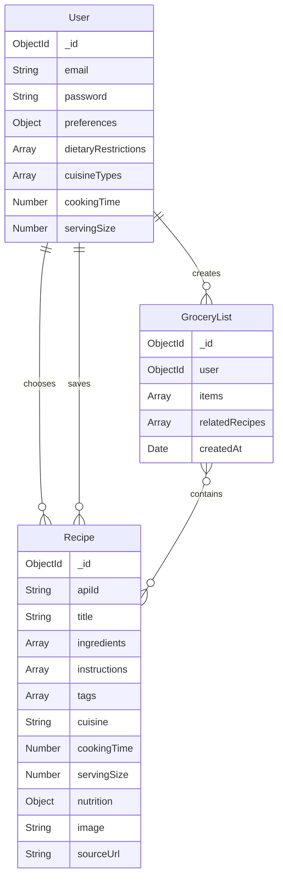

# Models Directory

This directory contains Mongoose models that define the data structure for the application.

## Files

### User.js
Defines the user schema and model:
- Fields: email, password (hashed), preferences (dietary restrictions, cuisine types, cooking time, serving size), chosenRecipes, savedRecipes, groceryLists.
- Passwords are hashed before saving using bcrypt.
- Includes a method to compare passwords for authentication.
- Timestamps for creation and update.

### Recipe.js
Defines the recipe schema and model:
- Fields: apiId, title, ingredients (name, quantity, unit), instructions (step, text), tags, cuisine, cookingTime, servingSize, nutrition, image, sourceUrl.
- Used to store and retrieve recipe data.

### GroceryList.js
Defines the grocery list schema and model:
- Fields: user (reference), items (name, quantity, unit, checked), relatedRecipes (references), createdAt.
- Items include normalization and validation for units.
- Used to manage grocery lists for users, linked to recipes.

# Database Schema Documentation

## Entity Relationship Diagram (ERD)

## Entity Descriptions

### User
- Primary entity for user management
- Stores user preferences and authentication details
- Links to chosen recipes, saved recipes, and grocery lists

#### Fields:
- `_id`: MongoDB ObjectId (Primary Key)
- `email`: String (unique)
- `password`: String (hashed)
- `preferences`: Object
  - `dietaryRestrictions`: Array of Strings
  - `cuisineTypes`: Array of Strings
  - `cookingTime`: Number
  - `servingSize`: Number
- `chosenRecipes`: Array of Recipe ObjectIds
- `savedRecipes`: Array of Recipe ObjectIds
- `groceryLists`: Array of GroceryList ObjectIds

### Recipe
- Stores recipe information and details
- Can be chosen or saved by users
- Can be linked to grocery lists

#### Fields:
- `_id`: MongoDB ObjectId (Primary Key)
- `apiId`: String (external API identifier)
- `title`: String
- `ingredients`: Array of Objects
  - `name`: String
  - `quantity`: Number
  - `unit`: String
- `instructions`: Array of Objects
  - `step`: Number
  - `text`: String
- `tags`: Array of Strings
- `cuisine`: String
- `cookingTime`: Number
- `servingSize`: Number
- `nutrition`: Object
- `image`: String
- `sourceUrl`: String

### GroceryList
- Manages shopping lists for users
- Links recipes to shopping items
- Tracks item status (checked/unchecked)

#### Fields:
- `_id`: MongoDB ObjectId (Primary Key)
- `user`: ObjectId (Foreign Key to User)
- `items`: Array of Objects
  - `name`: String
  - `quantity`: Number
  - `unit`: String (enum)
  - `checked`: Boolean
- `relatedRecipes`: Array of Recipe ObjectIds
- `createdAt`: Date

## Relationships

1. User to Recipe (One-to-Many)
   - A user can choose multiple recipes
   - A user can save multiple recipes
   - A recipe can be chosen/saved by multiple users

2. User to GroceryList (One-to-Many)
   - A user can create multiple grocery lists
   - Each grocery list belongs to one user

3. GroceryList to Recipe (Many-to-Many)
   - A grocery list can contain items from multiple recipes
   - A recipe can be referenced in multiple grocery lists

## Indexes

- User: `email` (unique)
- Recipe: `apiId` (for external API lookups)
- GroceryList: `user` (for user lookups)

## Data Validation

- Email addresses must be unique
- Passwords are hashed before storage
- Recipe ingredients must have name, quantity, and unit
- Grocery list items must have name, quantity, and valid unit
- All numeric values must be positive 